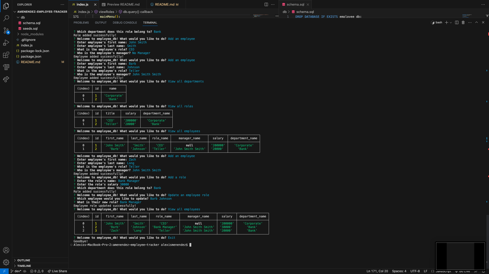

# Employee Tracker
This project aims to allow a user to keep track of the departments, roles, employees, and even assigned managers in a company while storing all this information in a database. The roles and employee prompts update dynamically as new departments/roles/employees are added in order to future proof the project. This makes looking at company hierarchy simplifed and easy to do!

This project definitely focused on creating and utilizing a MySql database with both viewing tables and adding to them. One of the challenges I faced was figuring out how to call the database each time the user wanted to add a role or employee to make sure that the options were updated and accurate. Overall, I definitely had to practice my javascript in order to accomplish my goals as well as overcoming hurdles such as async requests and utlizing promises so that prompts would load *after* a database call rather than before it. 

## Usage
[Demo Video](https://drive.google.com/file/d/1I1MBVd5Q0EhiAY6CqZYZQD3j1-DmtewN/view)
 
 

## Code Source
[Repository](https://github.com/alexismenendez/amenendez-employee-tracker)

## Resources & Assets
[Inquirer](https://www.npmjs.com/package/inquirer/v/8.2.4) 
[mysql2](https://www.npmjs.com/package/mysql2)